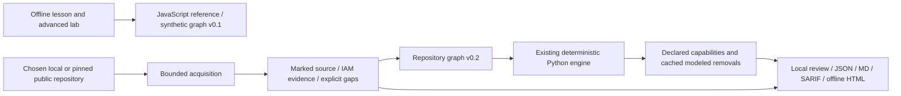
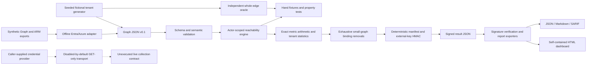

# Architecture

## Current Architecture

The current entry point is an offline learning journey in [ui/index.html](ui/index.html), generated from the lab source and also shipped as [src/blastradius/assets/lesson.html](src/blastradius/assets/lesson.html). The installed `blastradius learn` command opens it without a server. The lesson calls the existing JavaScript reference engine on BR-001 and compares reach with an explicit required-access set.

The optional Python package `blastradius` requires Python 3.12+, `jsonschema==4.26.0` and `PyYAML==6.0.3`. `blastradius review` is loopback-only. It accepts chosen repository declarations, not merely synthetic inputs; it neither executes target source nor evaluates deployed permissions.

The repository result contract is `repository-attack-path-v0.1`; it is not a synthetic engine result v0.1 accepted by the lab. Graph v0.1 remains frozen. Graph v0.2 records non-synthetic source provenance. Neither SHA-256 content hashes nor parser confidence authenticate deployed state.

| Boundary | Owner |
| --- | --- |
| Lesson, draft/model continuity, captions | [ui/app.js](ui/app.js) |
| Authoritative source and packaged HTML parity | [tools/build_ui.mjs](tools/build_ui.mjs) |
| Read-only local and public input | [acquisition.py](src/blastradius/repository/acquisition.py), [github.py](src/blastradius/repository/github.py) |
| Supported source semantics and gaps | [evidence.py](src/blastradius/repository/evidence.py), [aws_cloudformation.py](src/blastradius/repository/aws_cloudformation.py), [aws_terraform.py](src/blastradius/repository/aws_terraform.py) |
| Capability classification / removal reuse | [findings.py](src/blastradius/repository/findings.py), [scenarios.py](src/blastradius/repository/scenarios.py) |
| Session guards, stages, cooperative cancellation | [server.py](src/blastradius/repository/server.py), [operation.py](src/blastradius/repository/operation.py) |

Only fictional lesson progress and bundled-example selection/control IDs persist in browser storage. Real source results remain in process memory unless exported; leaving warns. Unknown alternatives remain separate from modeled reach. A zero modeled count is not a safe verdict. Cancellation/deadlines are checked between bounded operations, not an OS sandbox or a forced interruption of an in-flight read.

## Historical Prototype Architecture

The diagram and measurements below describe the earlier synthetic research pipeline, not the current first-run or repository-input contract. Historical release evidence is retained in [HANDOVER.md](HANDOVER.md) and [TEST_REPORT.md](TEST_REPORT.md).

## Ownership

| Module | Responsibility |
| --- | --- |
| model.py | Strict draft-2020-12 JSON validation, reference invariants, synthetic boundary, canonical JSON and snapshot hash |
| synthetic.py / oracle.py | Feature-complete seeded generator and classic illustration; separate repeated whole-edge set iteration for small-graph truth |
| engine.py | Priority-queue fixed point over `(node, action, actor)`; actor-local deny subtraction; guarded secret acquisition; zero/one escalation costs |
| analysis.py | Fraction-based arithmetic, absolute reach, weighted/bounded variants, p95/Gini/type summaries, explanations and actual what-if candidates |
| signing.py | OS-random external local HMAC key; content hash and HMAC validation; no key enters result artifacts |
| reports.py / assets/dashboard.html | Verified-source JSON/MD/SARIF/HTML export; all dashboard numbers derive from the signed result |
| connectors/entra_azure.py | Synthetic export envelopes, finite operation mapping, groups, scope/deny exclusions and explicit reviewed app/PIM/CA sidecars |
| connectors/transport.py | Gated GET-only transport, safe origins/paths, pagination limits, timeout/retry/redirect controls; fake-response tested only |
| cli.py | File-oriented workflows, input validation and overwrite protection |

## Core Semantics

The universe is every declared `(resource, action)` pair, including ungranted actions. Permission scenarios preserve it and all weights. Sensitivity weights are exact decimal fractions in [0,1]; an all-zero sensitivity denominator is undefined/null. Canonical and action-weighted denominators remain positive. Absolute reach is always published alongside normalization.

Static membership and already-active assignments cost zero escalation steps. Assumption, explicit secret acquisition and PIM activation cost one. Default constraints block device/approval, permit network/time, and permit eligibility only when no blocking constraint applies. Denies subtract actor-local actions across allow paths before counting; they are not merely nontraversable edges. Different acquired identities keep distinct deny contexts.

Explanatory paths minimize escalation count, hops and stable edge IDs to the highest-sensitivity reachable resource. This is a shortest-escalation witness, not every reachable path. The graph is finite and nonnegative costs plus increasing hop count prevent cycle improvements forever. Independent oracle tests use repeated whole-edge closure rather than the production priority queue.

## Reproducibility and Boundaries

Sort all unordered graph collections before analysis, retain snapshot observation time, and avoid ambient timestamps in results. The same graph, parameters and signing key produce byte-identical signed JSON. HMAC is local integrity protection, not a public-key research attestation; signed artifacts do not prove their input was complete or truthful.

Synthetic reports intentionally contain identifiers and graph topology. They are not anonymized benchmark submissions. General live authorization, encrypted tenant persistence, token/session claims, conjunctive multi-identity permission rules, resource action-catalog completeness and external review remain deferred. Exhaustive recommendation search is bounded explicitly to small demo graphs; benchmark timing excludes that search and any cloud collection.

Both scale targets were measured without replacing schema validation with a shortcut: 10000 principals/2000 resources/32119 edges in 51.63 s; 50000 principals/2000 resources/152119 edges in 215.38 s. These are synthetic workload measurements on recorded hardware, not a claim about arbitrary or live tenants.
