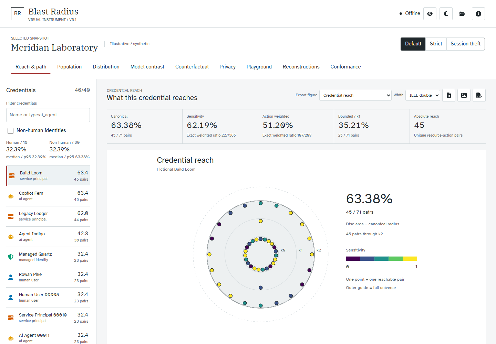
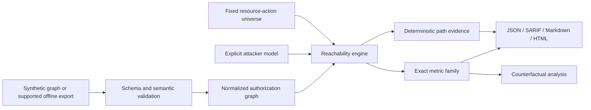

# Blast Radius

**A deterministic standard for measuring how far one compromised credential can reach.**

Blast Radius models authorization as a graph and reports the resource-action pairs reachable from each credential under an explicit attacker model. The repository contains the draft metric specification, conformance suite, Python and JavaScript reference implementations, synthetic research artifacts, offline connector profiles, and a self-contained visual instrument.

> [!IMPORTANT]
> Blast Radius is a research standard and reference implementation, not a production security product. It does not contact a tenant by default, does not collect secrets, and must not be treated as a compliance certification or proof of exploitability.



## Why Blast Radius?

Traditional permission inventories answer _what access is assigned?_ Blast Radius asks a narrower, reproducible question:

> Given one credential and a declared attacker model, which resource-action pairs are reachable through direct grants, group membership, role activation, identity assumption, and credential acquisition?

The result is a family of exact metrics rather than a single opaque score:

| Metric | What it measures |
| --- | --- |
| Canonical radius | Reachable pairs divided by the fixed resource-action universe |
| Sensitivity-weighted radius | Reach weighted by the declared sensitivity of each pair |
| Action-weighted radius | Reach weighted by the relative impact of each action |
| Bounded radius | Reach attainable within an explicit escalation budget |
| Population statistics | Maximum, nearest-rank p95, threshold share, and Gini concentration |

The denominator and weights are frozen for permission-only comparisons. Duplicate paths do not increase a score, cycles terminate, and every reported path has deterministic evidence.

## Repository Status

The current public profile is **1.0-draft**. The Python package and graph wire format remain **0.1**.

- 40 frozen conformance fixtures across 3 required attacker models
- 120/120 conformance cases passing in both Python and JavaScript
- 179 integrated Python tests passing with 93.40% line coverage
- Dependency-free JavaScript reference implementation
- Offline Entra/Azure, AWS IAM, and Kubernetes normalization profiles with explicit limits
- Deterministic synthetic research runs and reconstruction dossiers
- Static, offline-first visual instrument with figure export and accessibility checks

These are repository test results, not independent certification. See [TEST_REPORT.md](TEST_REPORT.md) for commands, hashes, measurements, and caveats.

## Quickstart

Requirements: Python 3.12+, [uv](https://docs.astral.sh/uv/), and Node.js for the optional JavaScript reference and UI tooling.

```powershell
uv venv --python 3.12 .venv
uv pip install --python .venv/Scripts/python.exe -e ".[test]"

.venv/Scripts/blastradius.exe synth `
  --principals 80 --resources 40 --seed 7 `
  --out results/tenant.json --force

.venv/Scripts/blastradius.exe analyze results/tenant.json `
  --constraint-model default `
  --out results/result.json --force

.venv/Scripts/blastradius.exe report results/result.json `
  --format html --out demo/index.html --force
```

Open `demo/index.html` directly in a browser. The report has no runtime server, CDN, or external font dependency. On macOS or Linux, replace `.venv/Scripts` with `.venv/bin` and use shell line continuations.

Generated outputs are never overwritten unless `--force` is supplied, and an input file cannot be replaced by its output.

## Run Conformance

Validate the Python implementation against the public suite:

```powershell
.venv/Scripts/blastradius.exe conformance run `
  --tool ".venv/Scripts/python.exe -B -m blastradius conformance adapter"
```

Validate the independent-language implementation:

```powershell
node reference-js/verify.mjs

.venv/Scripts/blastradius.exe conformance run `
  --tool "node reference-js/reference.mjs" `
  --out conformance/reports/javascript
```

Each case checks exact rational metrics, reachable pair sets, deterministic witnesses, and repeatability. Read [CONFORMANCE.md](CONFORMANCE.md) for the protocol and [conformance/REQUIREMENT_COVERAGE.md](conformance/REQUIREMENT_COVERAGE.md) for the boundary between automated, partial, and manual claims.

## Explore the Instrument

The current visual instrument is a static, local application:

```powershell
node tools/build_ui.mjs
```

Then open `ui/index.html`. It includes credential paths, population and distribution views, attacker-model contrast, counterfactual analysis, privacy experiments, reconstruction evidence, conformance results, and SVG/PNG/PDF figure export.

The source is split across `ui/index.template.html`, `ui/app.js`, `ui/render.js`, and `ui/styles.css`. The generated `ui/index.html` embeds its data and dependencies for offline inspection.

## CLI Workflows

```powershell
# Explain one credential's deterministic witness paths
.venv/Scripts/blastradius.exe explain results/result.json `
  --credential credential-principal-00001

# Recompute the graph after a hypothetical binding removal
.venv/Scripts/blastradius.exe whatif results/tenant.json `
  --remove-binding shared-2

# Verify a locally signed result manifest
.venv/Scripts/blastradius.exe verify-manifest results/result.json

# Normalize supported synthetic export bundles without cloud access
.venv/Scripts/blastradius.exe collect-entra-azure `
  --exports connectors/entra_azure/fixtures/rich `
  --out results/connector-tenant.json
```

Reports support JSON, SARIF, HTML, and Markdown. Local result integrity uses an external OS-random HMAC key; this is not public attestation, and the key is never included in repository artifacts.

## How It Fits Together



The engine consumes effective authorization decisions; it does not attempt to reproduce every cloud provider's policy evaluator. Unsupported semantics are rejected or identified as coverage gaps rather than silently inferred.

For the formal definitions and implementation boundaries, read:

- [Metric Specification](spec/METRIC_SPECIFICATION_v1.0-draft.md)
- [Architecture](ARCHITECTURE.md)
- [Conformance Protocol](CONFORMANCE.md)
- [Decision Log](DECISIONS.md)
- [Reconstruction Method](RECONSTRUCTION_METHOD.md)

## Reproduce the Evidence

```powershell
# Full Python test, coverage, and artifact gate
.venv/Scripts/python.exe -B tools/verify.py

# Frozen historical reconstructions
.venv/Scripts/python.exe -B tools/build_reconstructions.py

# Preregistered synthetic privacy and NHI runs
.venv/Scripts/python.exe -B tools/run_research.py

# Offline Kubernetes normalization fixture
.venv/Scripts/python.exe -B tools/build_kubernetes_fixture.py
```

Research outputs use fictional tenants and investigator-designed distributions. They test methods and failure modes; they do not estimate a real-world population. See [PRIVACY_ANALYSIS.md](PRIVACY_ANALYSIS.md), [research/NHI_RESULTS.md](research/NHI_RESULTS.md), and [research/DATASET_CARD.md](research/DATASET_CARD.md).

## Safety and Scope

Blast Radius currently supports synthetic inputs and bounded offline export profiles. Before using real organizational data, the project still requires protected persistence, public-verifier signing, reviewed key custody, connector ground-truth studies, complete policy semantics, independent privacy review, and an authorized disclosure process.

The Entra/Azure live transport is library-only, disabled by default, and tested with fake responses. The AWS and Kubernetes adapters intentionally cover finite profiles rather than full provider semantics. Read each connector manifest before interpreting its output.

Never commit signing keys, `.env` files, live exports, or private result files. See [SECURITY.md](SECURITY.md) for the data boundary and reporting process.

## Project Map

| Path | Purpose |
| --- | --- |
| `spec/` | Normative draft metric specification and visual vocabulary |
| `schema/` | Versioned graph and result schemas |
| `src/blastradius/` | Python reference implementation and CLI |
| `reference-js/` | Dependency-free JavaScript reference implementation |
| `conformance/` | Frozen fixtures, manifest, requirements, and reports |
| `connectors/` | Explicitly bounded offline normalization profiles |
| `research/` | Synthetic protocols, outputs, and dataset documentation |
| `reconstructions/` | Public-incident mechanism dossiers and countermodels |
| `ui/` | Visual instrument source, generated app, and test evidence |
| `tools/` | Reproduction, audit, benchmark, and build scripts |

## Contributing

Start with [CONTRIBUTING.md](CONTRIBUTING.md), then read [GOVERNANCE.md](GOVERNANCE.md), [NEUTRALITY.md](NEUTRALITY.md), and the [Code of Conduct](CODE_OF_CONDUCT.md). Contributions should preserve deterministic outputs, explicit uncertainty, and the distinction between validated structure and verified provider semantics.

## License

Licensing is split by artifact type:

- Code: [Apache License 2.0](LICENSE)
- Specification and schema: [Creative Commons Attribution 4.0](LICENSING.md)
- Generated or approved aggregate data: [CC0 1.0](LICENSING.md)

See [LICENSING.md](LICENSING.md) for the authoritative file-level policy.
